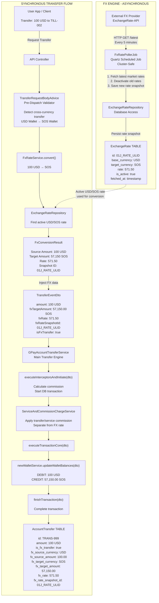

```mermaid
flowchart TB

    %% =========================================================
    %% FX RATE ENGINE - ASYNCHRONOUS
    %% =========================================================

    subgraph FX["FX ENGINE - ASYNCHRONOUS"]

        PROVIDER["External FX Provider<br/>ExchangeRate-API"]

        POLLER["FxRatePollerJob<br/>Quartz Scheduled Job<br/>Cluster-Safe"]

        REPOSITORY["ExchangeRateRepository<br/>Database Access"]

        RATE["ExchangeRate TABLE<br/><br/>id: 01J_RATE_ULID<br/>base_currency: USD<br/>target_currency: SOS<br/>rate: 571.50<br/>is_active: true<br/>fetched_at: timestamp"]

        PROVIDER -->|"HTTP GET /latest<br/>Every 5 minutes"| POLLER

        POLLER -->|"1. Fetch latest market rates<br/>2. Deactivate old rates<br/>3. Save new rate snapshot"| REPOSITORY

        REPOSITORY -->|"Persist rate snapshot"| RATE

    end


    %% =========================================================
    %% SYNCHRONOUS TRANSFER FLOW
    %% =========================================================

    subgraph TRANSFER["SYNCHRONOUS TRANSFER FLOW"]

        CLIENT["User App / Client<br/><br/>Transfer: 100 USD to TILL-002"]

        CONTROLLER["API Controller"]

        VALIDATOR["TransferRequestBodyAdvice<br/>Pre-Dispatch Validator<br/><br/>Detect cross-currency transfer<br/>USD Wallet → SOS Wallet"]

        FX_SERVICE["FxRateService.convert()<br/><br/>100 USD → SOS"]

        ACTIVE_RATE["ExchangeRateRepository<br/><br/>Find active USD/SOS rate"]

        RESULT["FxConversionResult<br/><br/>Source Amount: 100 USD<br/>Target Amount: 57,150 SOS<br/>Rate: 571.50<br/>Snapshot ID: 01J_RATE_ULID"]

        DTO["TransferEventDto<br/><br/>amount: 100 USD<br/>fxTargetAmount: 57,150.00 SOS<br/>fxRate: 571.50<br/>fxRateSnapshotId: 01J_RATE_ULID<br/>isFxTransfer: true"]

        ENGINE["GPayAccountTransferService<br/>Main Transfer Engine"]

        INTERCEPTOR["executeInterceptorsAndInitiate(dto)<br/><br/>Calculate commission<br/>Start DB transaction"]

        COMMISSION["ServiceAndCommissionChargeService<br/><br/>Apply transfer/service commission<br/>Separate from FX rate"]

        CORE["executeTransactionCore(dto)"]

        BALANCE["newWalletService.updateWalletBalances(dto)<br/><br/>DEBIT: 100 USD<br/>CREDIT: 57,150.00 SOS"]

        FINISH["finishTransaction(dto)<br/><br/>Complete transaction"]

        RECORD["AccountTransfer TABLE<br/><br/>id: TRANS-999<br/>amount: 100 USD<br/>is_fx_transfer: true<br/>fx_source_currency: USD<br/>fx_source_amount: 100.00<br/>fx_target_currency: SOS<br/>fx_target_amount: 57,150.00<br/>fx_rate: 571.50<br/>fx_rate_snapshot_id: 01J_RATE_ULID"]

        CLIENT -->|"Request Transfer"| CONTROLLER

        CONTROLLER --> VALIDATOR

        VALIDATOR --> FX_SERVICE

        FX_SERVICE --> ACTIVE_RATE

        ACTIVE_RATE --> RESULT

        RESULT -->|"Inject FX data"| DTO

        DTO --> ENGINE

        ENGINE --> INTERCEPTOR

        INTERCEPTOR --> COMMISSION

        COMMISSION --> CORE

        CORE --> BALANCE

        BALANCE --> FINISH

        FINISH --> RECORD

    end


    %% =========================================================
    %% CONNECTION: ASYNC RATE → SYNC TRANSFER
    %% =========================================================

    RATE -.->|"Active USD/SOS rate<br/>used for conversion"| ACTIVE_RATE
```
